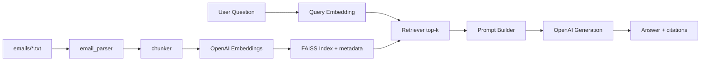

# Mini RAG System (Email Corpus)

This repository contains a complete Retrieval-Augmented Generation (RAG) implementation for the provided synthetic email dataset.

## What Is Implemented

- Document parsing for all `emails/email_*.txt`
- Token-aware chunking with overlap
- Embedding generation using OpenAI embeddings
- Local FAISS cosine-similarity retrieval
- Answer generation from retrieved context using OpenAI chat model
- FastAPI interface for indexing and Q&A
- Browser UI for index + question answering at `/`
- Automated evaluation pipeline and report generation
- Tests, Docker support, and a submit-check command
- Offline fallback mode (deterministic embeddings + heuristic answers) when no API key is set

No end-to-end RAG framework (LangChain/LlamaIndex) is used.

## Architecture



## Chunking Strategy

- Input text per email is normalized into:
  - Subject
  - From
  - To
  - Body
- Chunk size: `220` tokens
- Overlap: `40` tokens
- Rationale:
  - keeps each chunk semantically meaningful,
  - preserves recall across sentence boundaries,
  - controls token cost for retrieval + generation.

## Embedding and Storage

- Embedding model: `text-embedding-3-small`
- Fallback when `OPENAI_API_KEY` is not provided: deterministic local hash-based embeddings
- Similarity metric: cosine similarity via normalized vectors and `IndexFlatIP`
- Stored artifacts:
  - `artifacts/faiss.index`
  - `artifacts/chunks.jsonl`
  - `artifacts/index_manifest.json`

## Retrieval and Generation

- Query is embedded with the same embedding model.
- Query embedding uses OpenAI when available, else deterministic local embedding.
- Top-k chunks (default k=5) are retrieved from FAISS.
- Prompt constrains model to context-grounded answers and asks for citations.
- Generation uses OpenAI when available, else a heuristic summarizer from top retrieved chunks.
- Response includes:
  - answer text,
  - citations (`email_id`, `chunk_id`, similarity score, subject),
  - latency.

## API

Run the API and use:

1. `GET /health` -> service status and index state
2. `GET /config` -> runtime model/chunk config
3. `POST /index` -> build and persist index from `emails/`
4. `POST /ask` -> ask questions over indexed corpus

Example request:

```bash
curl -X POST http://127.0.0.1:8000/ask \
  -H "Content-Type: application/json" \
  -d '{"question":"Which emails discuss budget approvals?","top_k":5,"debug":false}'
```

## Quality Evaluation Approach

`scripts/evaluate.py` generates:

- Retrieval metrics:
  - Recall@5
  - MRR
- Generation proxy metric:
  - citation-line ratio (only when `OPENAI_API_KEY` is set)

Outputs:

- `artifacts/eval_results.json`
- `artifacts/evaluation_report.md`

## Tradeoffs

- `IndexFlatIP` is exact but memory-heavy at larger scales; acceptable for 100 emails.
- Keyword-based relevance proxy in evaluation is lightweight and transparent, but not a gold-label benchmark.
- OpenAI models maximize implementation quality quickly but require API access.

## Local Setup (End-to-End)

```bash
cp .env.example .env
# set OPENAI_API_KEY in .env for OpenAI-backed mode (optional for local fallback)

make setup
make index
make test
make eval
make run
```

API available at `http://127.0.0.1:8000`.
UI available at `http://127.0.0.1:8000/`.

You can explicitly test the RAG system end-to-end using this local website UI (`http://127.0.0.1:8000/`) by building the index and asking questions directly in the browser.

## One-Command Submission Validation

```bash
make submit-check
```

This runs tests, rebuilds index, runs evaluation, and verifies required artifacts are present.

## Docker

```bash
docker build -t mini-rag-email .
docker run --rm -p 8000:8000 --env-file .env mini-rag-email
```

## Repository Contents

- `app/` core pipeline modules
- `scripts/build_index.py` offline indexing
- `scripts/evaluate.py` evaluation + report generation
- `tests/` unit and API tests
- `artifacts/` generated index/eval outputs

## Submission Checklist

1. Ensure `make submit-check` passes.
2. Commit all code and generated evaluation report.
3. Push to a public Git repository.
4. Share the repository URL.
